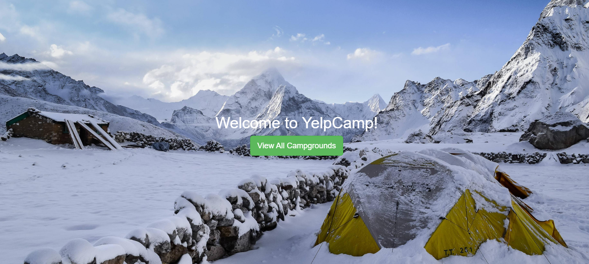
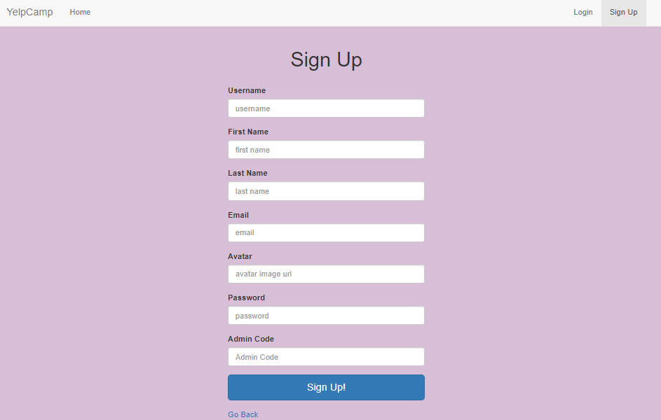
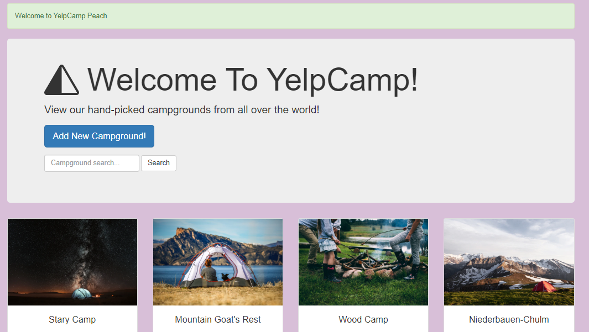
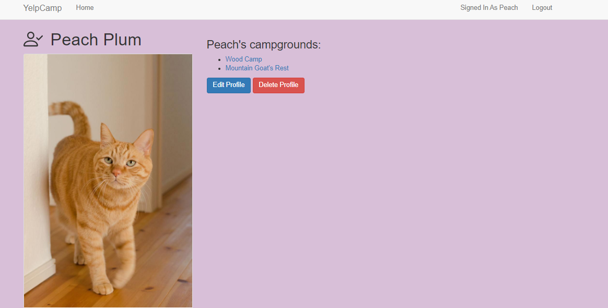
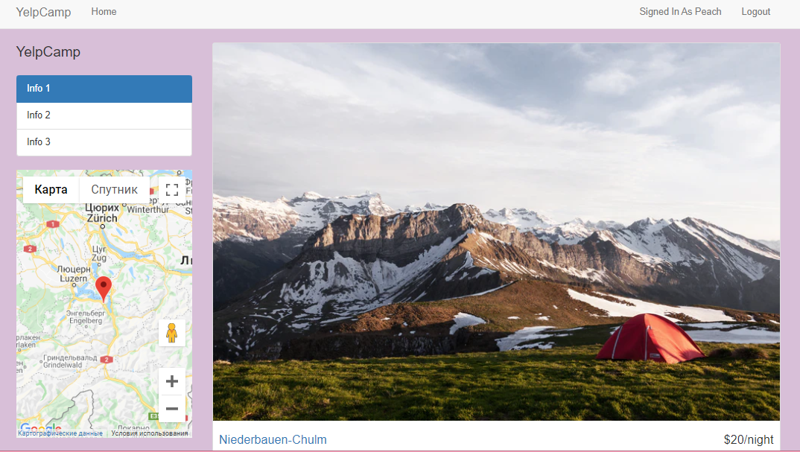
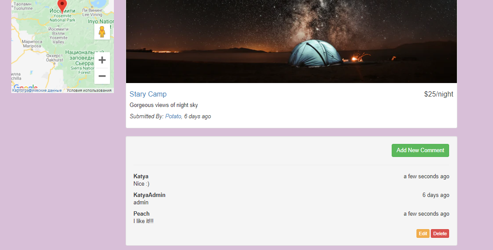

# YelpCamp
## Web app for tourists to store and share information about campgrounds. Users can Sign Up and Sign In to the system, add new and view previously added campgrounds.
### Animated Landing Page

### Sign Up Page

### Campgorund show page

### User Profile

### Campground

### Comments

## Technology stack
HTML, CSS, Bootstrap, EJS and Google Maps API on client side  
Express.js, RESTful routes, passport.js and MongoDB on server side